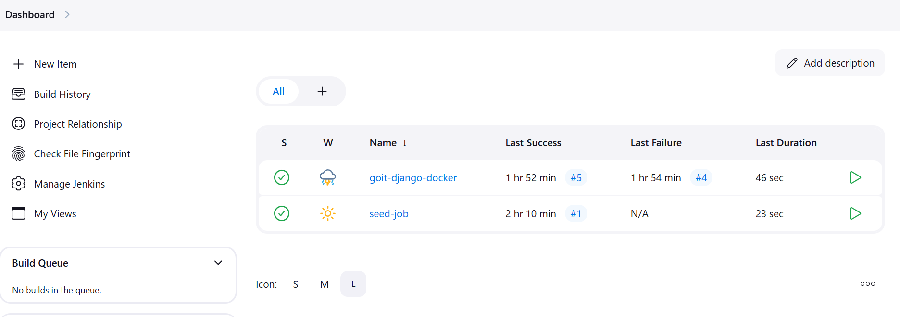
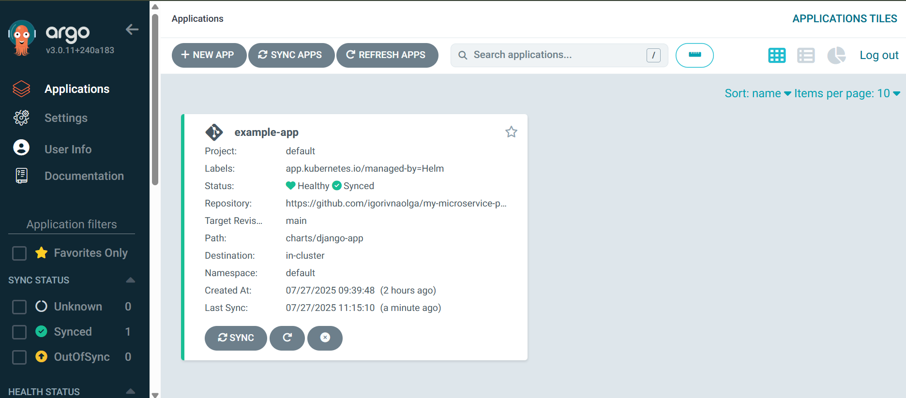
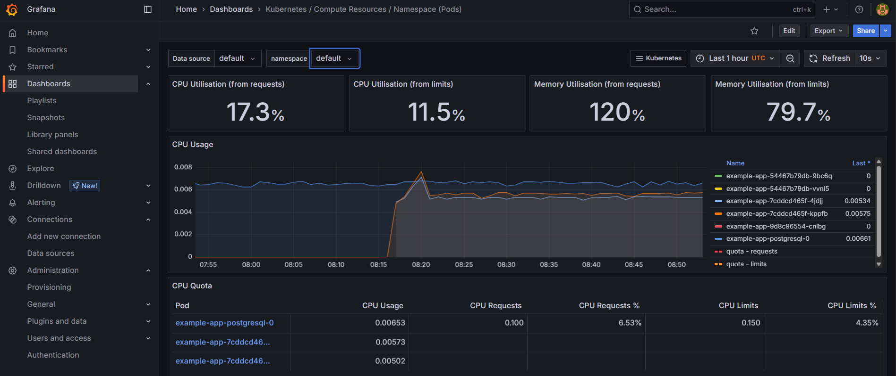

# Final DevOps Project – AWS Infrastructure with Terraform

This project sets up a complete CI/CD pipeline and monitoring stack using AWS, Terraform, and various DevOps tools including Jenkins, Argo CD, EKS, RDS, ECR, Prometheus, and Grafana.

## Prerequisites

### Make sure the following are installed and configured:

- AWS account with sufficient permissions
- AWS CLI configured (aws configure)
- Docker installed and running
- kubectl installed
- Helm installed
- Terraform installed

###  Create `terraform.tfvars` File

Rename `terraform.tfvars.example` to `terraform.tfvars` and fill in the required values:

```hcl
github_repo_url = "https://github.com/<github_username>/<project_name>.git"
github_branch = "main"
github_user = "github_username"
github_pat = "github_token"

rds_password = "password_for_rds_db"
rds_publicly_accessible = true
rds_use_aurora = true
rds_multi_az = false
rds_backup_retention_period = "0"
```

## 🛠️ Terraform Commands

### 1. **Initialize the project**

Installs the required providers and sets up the backend:

```bash
terraform init
```

### 2. **Check the execution plan**

Shows what Terraform will do before applying it:

```bash
terraform plan
```

### 3. **Apply the configuration**

Creates or updates infrastructure:

```bash
terraform apply
```
Connect kubectl to your cluster:

```bash
aws eks update-kubeconfig --region ap-southeast-2 --name <your_cluster_name>
```

### 4. **Get Jenkins URL**

```bash
kubectl get all -n jenkins
```
Use login: admin, password: admin123

### 5. **Jenkins**
- Create a new pipeline job using the seed job.
- On Jenkins settings page select Script Approval and approve seed job script.
- Run the pipeline job to build the Docker image and push it to ECR.




### 6. **ArgoCD**
Terraform configuration includes Argo CD setup. ArgoCD applications and repositories are defined in the modules/argo_cd/charts directory and created during the Terraform apply.

Get ArgoCD URL:

```bash
kubectl get all -n argocd
```

To access the ArgoCD UI, you need to get the initial admin password. Run the following command:

```bash
kubectl -n argocd get secret argocd-initial-admin-secret -o jsonpath="{.data.password}" | base64 -d
```
Login: admin.
After Jenkins job execution, ArgoCD application is in Synced state.




### 7. RDS configuration options

You can configure the RDS module using the following variables in terraform.tfvars or as command-line options.

#### Configuration file

You can configure the RDS module using the following variables in terraform.tfvars:

rds_publicly_accessible = true # false for private access
rds_use_aurora = true # false for standard RDS instance
rds_multi_az = false # true for multi-AZ deployment
rds_instance_class = "db.t3.medium" # Instance class for RDS
rds_backup_retention_period = "0" # Set to "0" for no backups, or specify the number of days for backups


### Monitoring

- forward Grafana port using the next command:
```bash
kubectl port-forward -n monitoring svc/kube-prometheus-stack-grafana 3000:80
```
- open URL http://localhost:3000
- login with username admin and password from the next command
```bash
kubectl get secret --namespace monitoring kube-prometheus-stack-grafana -o jsonpath="{.data.admin-password}" | base64 --decode
```
- check existing dashboards to see the CPU and Memory usage (PODs, Nodes etc.)




### 9. **Destroy the Terraform resources**
```bash
terraform destroy
```
or:

```bash
chmod +x destroy.sh

./destroy.sh

```

